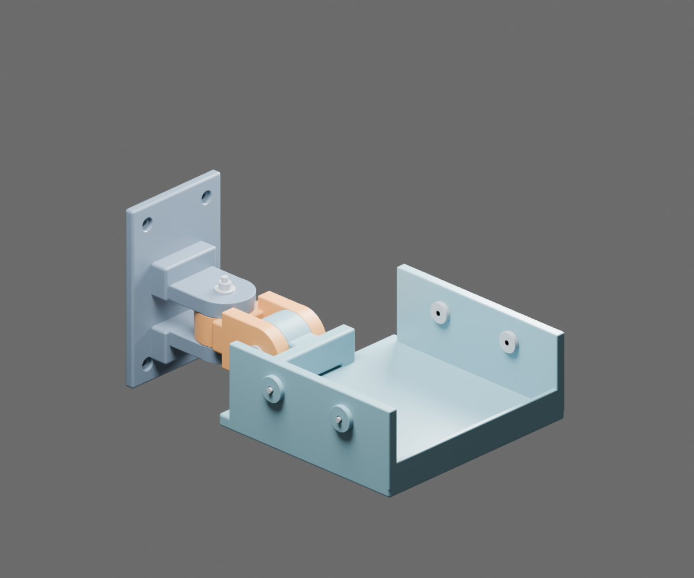
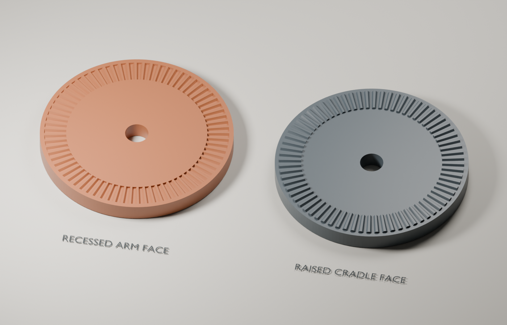
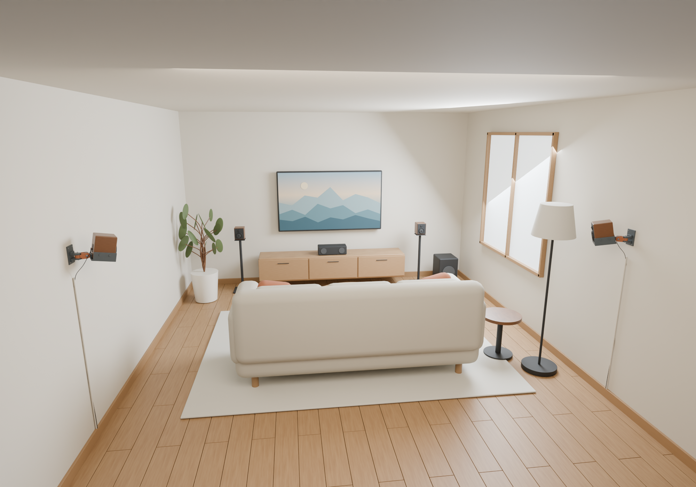
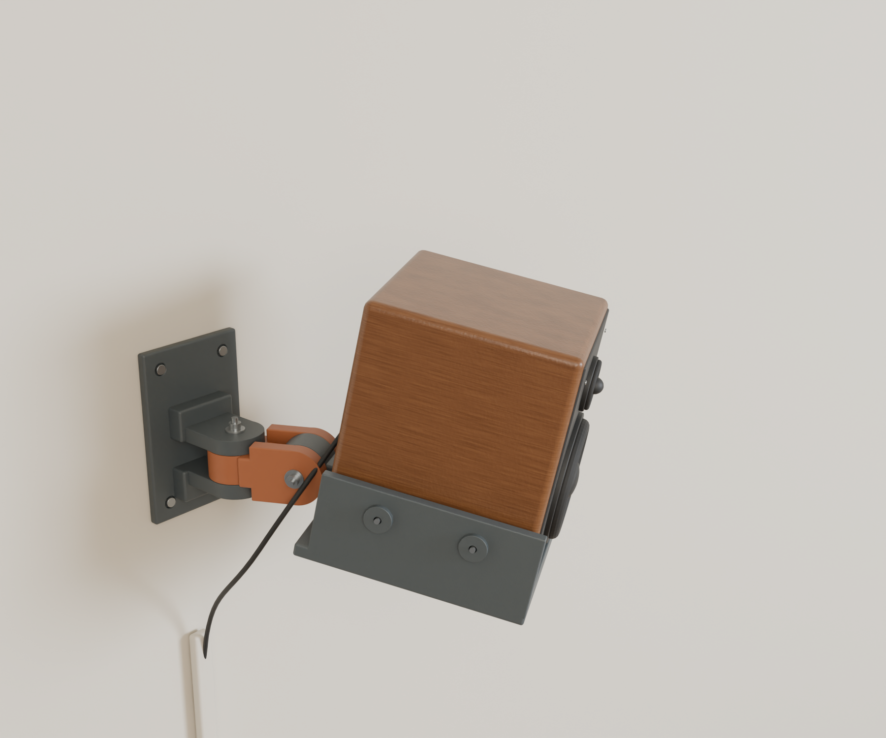
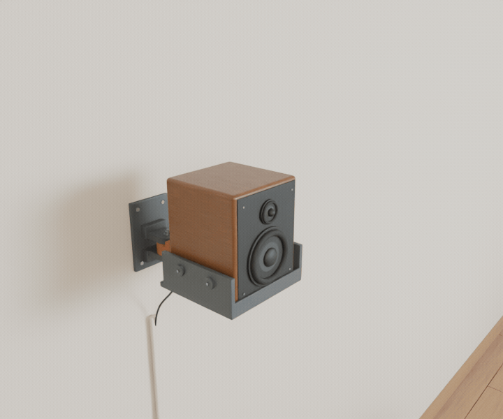

# Surround speaker wall mount — compact revision 3

The **[Eris E3.5 dorm-room rail adaptation](rail-mount/README.md)** has its own CAD, print files, concrete-through-rail fixing layout and furnished room renders. It provides ±90° pan and 0–60° indexed downward tilt; see its separate prototype and installation notes.

Three printed parts per speaker, identical for left and right. Default cabinet: **150 × 150 × 180 mm**. Designed motion: **continuous ±60° yaw; 0° to −30° pitch in 5° steps**. All CAD coordinates and STL coordinates are millimetres. This is an unqualified prototype: speaker mass, cabinet construction and wall substrate were not supplied; panel height and plug projection remain unconfirmed. There is no assigned safe working load or claim of permanent freedom from droop.


## Download and print

The **[print/](print/)** folder contains the three current, print-oriented STLs. Download **[speaker-mount-print-STLs.zip](speaker-mount-print-STLs.zip)** for all three plus a quick print guide. Print **two of each part** for a left/right pair.



For live mouse control in FreeCAD, run **[Open_Interactive_Assembly.FCMacro](Open_Interactive_Assembly.FCMacro)**: drag horizontally for pan and vertically for tilt. See [interactive instructions](INTERACTIVE_ASSEMBLY.md).

## Revision 3: indexed tilt, continuous pan

Only the **second (up/down) pivot** has mating radial serrations. The first
(left/right pan) pivot keeps its smooth friction faces and continuous adjustment.
The tilt interface has **72 teeth, giving 5° steps**: 0°, −5°, −10°, −15°, −20°,
−25° and −30°. Three main printed parts are retained; the wall plate is unchanged.

The arm's left inner cheek has a recessed female ring; the cradle's left pitch
face has the matching raised ring. Teeth occupy radii **16–21 mm** of the existing
44 mm joint. Male relief is **0.45 mm**, female groove depth **0.50 mm**. The
trapezoidal profile has broad crests/valleys, with a minimum nominal crest width
of about **0.42 mm** at the inner radius. Small flank/root relief leaves room for
fit variation; zero backlash is not promised.

**Adjustment:** support the speaker, loosen the tilt bolt, slide the cradle toward
the opposite smooth cheek to disengage the teeth, choose a 5° position, seat the
teeth and retighten. Do not force the teeth to ratchet under load. The two nominal
0.3 mm face gaps provide **0.6 mm axial travel from seated to released**, leaving
**0.15 mm nominal tip clearance** at release. Only one face is toothed so release
does not require spreading both clevis ears. Normal clamping still closes the
assembly clearance; tooth engagement and print tolerances must be checked.

The teeth provide positive angular engagement, but the bolt must keep them seated.
Actual rigidity, tooth strength, wear and long-term holding capacity have not been
measured. This is inspired by the radial face-coupling principle described by
[Voith](https://www.voith.com/corp-en/products-services/connection-components-couplings/hirth-serrations.html),
not a rated industrial Hirth coupling.



The two test discs above carry the same tooth profiles as the arm and cradle.
Print the [two fit coupons](print/fit-coupons/) first. Reprint **both the arm and
cradle** for this revision; do not mix a revision 2 smooth part with a revision 3
toothed part. Revision 2 remains available in Git history.

## Compact revision

The pivot spacing is now **55 mm instead of 100 mm (45% shorter)**. The slender connecting span is replaced with a short, wider connector. The speaker rear face sits **147 mm from the wall instead of 197 mm**, a 50 mm reduction. The rear support is only 36 mm high, instead of 102 mm, and the wall plate is 140 mm tall instead of 160 mm. Both full ±60° pan and −30° tilt are retained in the sampled clearance checks. Further wallward shortening consumes the clearance needed when the wide tray is turned 60°.

Your terminal description is interpreted as a centered 40 mm-wide panel (150 − 2×55), with its lower edge 40 mm above the speaker bottom. The tilt pivot is lowered to Z=24 mm, leaving the hardware below the panel. Panel **height is provisionally 60 mm** and connected-plug projection is provisionally **30 mm**. A 50 mm-wide × 70 mm-high clearance box includes 5 mm border margin around that assumed panel, extending 30 mm behind the cabinet. This box is included in the collision checks. The panel is shown in black in Blender; its assumed height is named explicitly in the scene.

The compact geometry reduces the free arm span, but stiffness has not been measured. A lower pivot also changes the gravity torque at downward tilt: the load notes below have been updated rather than assuming every load decreases. `revision_1_original.zip` preserves the previous design locally; the main ZIP contains the current revision 3.

## How this will look

A Blender living-room showcase places the current mount geometry in an illustrative
surround setup with a TV, couch and mounted speakers. The unbranded cabinets match
the design envelope; these are concept renders, not a tested installation.







The tilt joint releases axially, changes by 5°, and re-seats. Pan stays continuous.

See [showcase/](showcase/) for the editable Blender scene, rendering script and details.

## Interactive assemblies

Open `output_blender/interactive_assembly.blend` or `output_freecad/interactive_assembly.FCStd` to pose the mount. See [INTERACTIVE_ASSEMBLY.md](INTERACTIVE_ASSEMBLY.md) for the two angle controls and optional FreeCAD slider macro.

## Files and execution

- `parametric_mount.py`: standalone FreeCAD script; Spreadsheet-driven scripted PartDesign bodies.
- `blender_mount.py`: standalone `bpy` model builder, articulated scene, mesh validator, STL exporter and render.
- `output_freecad/`: FCStd, STEP, three print-oriented STL files and CAD validation reports.
- `output_blender/`: Blender scene, assembly image, three print-oriented STL files and mesh report.
- `validate_cad.py`: sampled collision and parameter dependency checks; imports `parametric_mount.py`.
- `geometry_spec.py`: readable geometry reference. Each standalone builder contains its own copy, so neither requires this file. When changing geometry, keep both builders consistent.
- `FREECAD_MCP_SETUP.md`: detection and connection instructions.

Run on this machine:

```bash
cd surround-speaker-mount
python parametric_mount.py
python validate_cad.py
blender --background --factory-startup --python blender_mount.py
```

System Python works here because the script finds `/usr/lib/freecad/lib`. On another OS, run in FreeCAD's Python console:

```python
import sys
sys.path.insert(0, '/absolute/path/to/surround-speaker-mount')
import parametric_mount
parametric_mount.build()
```

Each execution makes a new document/scene and replaces generated output files. Blender preserves other scenes in its current session; use the background command above for a clean deliverable. Rendering uses CPU Cycles. No external assets or Python packages are required by the Blender script.

To reopen the FreeCAD file **with live recomputation**, add the script directory to `sys.path` and import `parametric_mount` before opening the FCStd. Its three bodies use `PartDesign::FeaturePython` backed by OpenCascade solids, not a conventional sketch/Pad/Pocket feature history. Each feature's dimensional properties are expression-linked to `Parameters`. Edit the spreadsheet and recompute. The file's saved shapes remain viewable without the module, but live rebuilding requires it. Re-export after edits:

```python
from pathlib import Path
import FreeCAD as App
import parametric_mount as m
doc = App.ActiveDocument
doc.recompute()
m.export(doc, [doc.getObject(n+'_Geometry') for n in m.NAMES],
         Path('/absolute/path/to/surround-speaker-mount/output_freecad'))
```

| Spreadsheet alias | Default | Effect |
|---|---:|---|
| Speaker_Width | 150 mm | Tray span, sides and clamp locations |
| Speaker_Depth | 150 mm | Tray depth, lip and clamp spacing |
| Speaker_Height | 180 mm | Side rail and clamp height |
| Clamp_Padding_Offset | 2 mm | Cabinet padding allowance |
| Insert_Hole_Diameter | 5.6 mm | Four M4 insert bores |
| Wall_Thickness | 4 mm | Lip; structural plate/rails use twice this value |

Structural thicknesses deliberately exceed 4 mm: tray 10 mm, wall plate 8 mm, side rails 8 mm, clevis ears 12 mm. Numeric parameter bounds reject grossly unsuitable dimensions; they do not certify every combination for clearance or strength. Recheck motion after changing dimensions. Blender uses the `DEFAULTS` dictionary near the top; it does not synchronize automatically with an edited FCStd.

## Geometry and joints

Wall plate: 90 × 140 × 8 mm, with four Ø4.8 mm screw passages on a 60 × 110 mm rectangular pattern. Ø10 × 3 mm counterbores have 0.5 mm radial, 45° mouth chamfers. Rounded edges are generally 1–2 mm. The plate's wall-contact plane is Y=0; its front is Y=8.

Yaw axis is vertical at (0,55,24); pitch axis runs left–right at (0,110,24). Both joints have 44 mm diameter faces and Ø5.3 mm bolt bores. Yaw faces are smooth; one pitch interface carries the revision 3 tooth ring. Wall clevis spacing is 24 mm with a 23.4 mm middle knuckle; pitch clevis spacing is 24.6 mm with a 24 mm tongue. **0.3 mm nominal clearance per mating face**, 0.6 mm total, is taken up when tightening. Washers go outside the ears, not in these gaps. Keep yaw friction faces dry and flat, and keep tilt teeth clean. Yaw is continuous; tilt seats at 5° increments. Software limits are not physical end stops.

The cabinet rests at Z=12 with 2 mm shelf foam. Rear face Y=147, front face Y=297. Lip inner face Y=299 leaves 2 mm for padding; the 26 mm high lip overlaps the speaker bottom by 14 mm. Clamp rail inner faces X=±81 leave 6 mm per side: **4 mm swivel foot plus 2 mm foam**. Side rails end at Z=68.4; clamp centers are Z=48.6 and Y=190/257.5.

The rear bridge ends at Z=36 mm; the measured panel lower edge is Z=52 mm (10 mm shelf + 2 mm foam + 40 mm cabinet offset). The pitch knuckle top is Z=46 mm. The centered terminal region above this is open. The provisional terminal-and-plug clearance box spans X=−25…25, Y=117…147 and Z=47…117 mm. Route wires upward or sideways out of this region, then in a loose service loop clear of both joints. The rectangular clearance check does not simulate a flexible cable or establish a bend radius.

## Hardware BOM

Dimensions below correspond to the default geometry. Count two of each printed part for the pair.

| Hardware | Per speaker | Pair | Specification |
|---|---:|---:|---|
| Yaw and pitch screws | 2 | 4 | M5 × 60 mm socket head cap screws, steel, length under head |
| Joint locknuts | 2 | 4 | M5 nylon-insert locknuts, about 5 mm high |
| Joint load-spreading washers | 4 | 8 | M5, ID 5.3 mm, OD 15 mm, thickness 1.5 mm |
| Clamp screws | 4 | 8 | M4 × 25 mm threaded shaft, commercial ball-ended swivel-pressure screws, detachable feet |
| Swivel pressure feet | 4 | 8 | Ø16 mm, 4 mm effective axial thickness; compatible with selected M4 screws |
| Clamp jam nuts | 4 | 8 | M4, gently lock screw position after setting pressure |
| Heat-set inserts | 4 | 8 | M4, 6 mm long, nominal OD about 6 mm; straight-hole style suitable for selected polymer |
| Wall screws | 4 | 8 | #8 / Ø4.0–4.5 mm, low pan head ≤9.5 mm diameter and ≤3 mm high |
| Wall anchors | As needed | As needed | Matched to substrate, screw and evaluated pullout/shear loads |
| Foam | ~0.8 m | ~1.6 m | 2 mm thick × 20 mm wide closed-cell EVA/EPDM self-adhesive tape |
| Independent retention | 1 | 2 | Rated strap/harness enclosing cabinet, attached to a separate suitable wall fixing |

M5 grip: yaw plastic 48 mm, pitch plastic 48.6 mm; two 1.5 mm washers plus a ~5 mm nut leave roughly 4 mm or 3.4 mm of thread beyond the nut with M5×60. Confirm full nylon engagement with the actual hardware. Nut and head seats remain externally accessible; the model does not rely on printed threads or trapped nuts for the joints.

M4 shaft/foot products have differing length conventions. The model reserves a 12 mm boss/rail depth, 4 mm inward foot thickness and 2 mm foam. Confirm the supplier's drawing gives this working reach and that the foot can be attached **after** threading the shaft through the insert. Do not substitute a bare screw tip against the cabinet. The Blender hardware is an illustrative envelope, not a manufacturing drawing of purchased components.

The 5.6 mm insert hole is a starting value, **not a universal M4 standard**. Buy an insert whose specified installation hole matches your print, or change the parameter. Install from the **cabinet-facing side** so the clamp reaction tends to push the insert into its boss. The 12 mm through-bore leaves travel behind a 6 mm insert. Test an isolated boss cropped in the slicer before printing the full tray. Hole sizing, polymer and boss dimensions determine insert performance; follow the [insert manufacturer's guidance](https://www.spirol.com/resources/white-papers/how-to-design-the-proper-hole-for-heat-ultrasonic-inserts/).

Wall screw **length cannot be finalized without the wall build-up**. Example only: 4.5 × 60 mm screws through the remaining 5 mm counterbore floor and 12.5 mm plasterboard leave 42.5 mm nominal penetration into timber. Verify screw/anchor manufacturer requirements and obstructions. The 60 mm wide hole pattern does not put all four screws into one narrow stud: use structural backing spanning studs, suitable masonry fixing, or a verified anchor arrangement. Do not assume a generic drywall anchor is adequate.

## Printing and assembly

Use PETG or ASA with a validated filament profile. ASA needs suitable enclosure and ventilation; see [Prusa's ASA guidance](https://help.prusa3d.com/article/asa_1809?product=mk3-5) and [PETG guidance](https://help.prusa3d.com/article/petg_2059?product=mini). Neither material makes this a creep-free joint; the tilt teeth also require fit and wear checks. The following settings are design recommendations, not measured strength data:

- 0.4 mm nozzle, 0.20 mm layers; **6 perimeters**, 6–8 top/bottom layers, **45–50% gyroid**.
- Set local solid infill around pivot ears, arm roots, rear cradle supports and insert bosses. At least 4–5 walls and 35% infill as requested; the higher values above provide a more conservative starting point.
- Print all three parts **on their X side**, as already oriented in the exported STLs. The arm is flipped relative to revision 2 so its female tilt face points up; the cradle's male tilt face also points up. This places the main Y–Z cantilever bending plane within printed layers. It reduces the critical delamination tendency; it cannot eliminate every transverse tensile stress in a two-axis bracket.
- Use 0.10–0.12 mm layers through the toothed region and verify that the slicer preserves the teeth. Use support blockers on the serrated face; route supports for the opposite ear from smooth regions or the bed. Print and hand-fit the coupons first.
- Use removable supports under raised rails, upper clevis ears, bosses and horizontal bores; inspect the layer preview. Support is not limited to the build plate if that leaves internal overhangs unsupported. Use a brim and protect friction surfaces when removing supports.

| STL | Print bounding box X × Y × Z |
|---|---|
| Part_1_WallPlate | 140 × 77 × 90 mm |
| Part_2_SwivelArm | 44 × 99 × 48.6 mm |
| Part_3_Cradle | 68.4 × 215 × 186 mm |

A **250 mm bed** is recommended for cradle supports and brim; a 220 mm bed leaves only 5 mm total margin in the long direction before supports/brim. STL files are unitless by convention: import as millimetres, verify these dimensions, and do not auto-scale. Print a second identical set for the opposite surround. Do not mirror only one mating part.

1. Confirm speaker mass, terminal clearance, pressure-foot dimensions and wall fixing design. Measure the printed bores and check slip fits before heating inserts.
2. Remove supports, deburr, and carefully finish M5 holes to 5.3 mm if needed. Do not enlarge insert bores without the insert data sheet. Reject split layers or under-extruded parts.
3. Heat-install four M4 inserts from inside the cradle; use a perpendicular installation tip and allow full cooling. Attach the pressure feet after threading the clamp screws through the inserts.
4. Place two 150 mm foam strips on the shelf, foam on the front lip and rear contact columns, and Ø16 mm foam disks on the four pressure feet. Keep foam away from pivot friction surfaces.
5. Assemble yaw and pitch using M5×60 screws, one washer under each head and one under each locknut. Snug the yaw joint until friction is established. Fully seat the tilt teeth at a 5° position before tightening its bolt. Do not apply a generic steel-joint torque value: the plastic seats and ears are the limiting components.
6. Seat the speaker fully on the padded shelf. Tighten the four pressure screws evenly until it is retained without visible cabinet deflection. Gently snug jam nuts while holding each screw. The shelf and lip carry gravity/sliding loads; clamps are not permission to crush the enclosure.
7. Test the complete assembly with a restrained dummy load close to the floor before wall installation. Establish required holding torque and monitor tilt, ear gap and permanent deformation over an extended dwell at expected room temperature. A short test does not establish long-term life. Add independent cabinet retention for overhead use.
8. Remove the speaker, fasten the plate to the evaluated wall fixings, then reinstall and aim it. Hand-support the speaker while loosening either joint. Keep yaw within ±60° and tilt within 0° to −30° in 5° steps. Disengage the tilt teeth before turning, then seat and retighten. If it drifts, rocks or fails to engage, stop and inspect or redesign the joint instead of overtightening.
9. Reinspect after initial settling and periodically thereafter. Inspect the tilt teeth for incomplete seating, wear, cracking and debris. Printed teeth do not establish maintenance-free holding; nylon locknuts alone do not provide that function.

## Load assessment and verification limits

For a uniformly distributed default cabinet, its center is approximately Y=222, Z=102. Relative to the new pitch pivot, that is 112 mm forward and 78 mm upward. The horizontal pitch lever arm is 112 mm at level and **136 mm at −30°**. Speaker-only torque is therefore **1.099 × mass_kg N·m** at level, rising to **1.334 × mass_kg N·m** at −30°. Wall torque is **2.178 × mass_kg N·m** at level and **2.413 × mass_kg N·m** at −30°. Add the cradle, arm, hardware, cable forces and handling loads. A 2 kg cabinet alone at −30° produces about 2.67 N·m at pitch and 4.83 N·m at the wall; this is not a 2 kg rating.

The original pitch friction-capacity estimate no longer describes the revision 3
load path. Tilt torque now loads the tooth flanks, while bolt preload must resist
separation and keep them engaged. The nominal tooth geometry is not a strength
rating: print accuracy, root stress, uneven tooth contact and polymer creep still
need assessment. Yaw continues to rely on friction. FEA, coupon load tests and a
load-duration test have not been performed.

The CAD validator checks 91 sampled pan/tilt positions (10°/5° increments) against the wall, fixed plate, arm, cradle, cabinet envelope and the provisional terminal/plug envelope. It also changes all six spreadsheet parameters individually and verifies recomputation into single valid solids. This is not continuous swept-volume proof; purchased fasteners, flexible cable loops, foam compression and deformation are excluded. Blender independently checks zero nonmanifold edges, one connected component and positive enclosed volume before STL export. Meshes approximate the analytic CAD fillets, so small volume differences are expected.

Final export verification also re-imported all six STLs into FreeCAD Mesh: all reported closed solids with no nonmanifold edges (`stl_validation.json`). Revision 3 needed no boundary repairs. The Blender script retains a tightly limited small-quad repair for Boolean artifacts, then rejects any remaining nonmanifold geometry. Runtime: FreeCAD 1.1.3, Blender 5.2.0. The local Blender installation emitted an unrelated bundled-addon `cattrs` import warning; model generation, both renders and export checks completed.

The revision 3 tilt validator (`validate_tilt_index.py`) checks all seven indexed
positions at nominal and seated offsets, confirms interference at every half-step
when seated, and checks 61 released positions at 0.5° intervals. It exports the
fit coupons and `output_freecad/tilt_index_validation.json`. These are geometric
checks, not strength or wear measurements.
