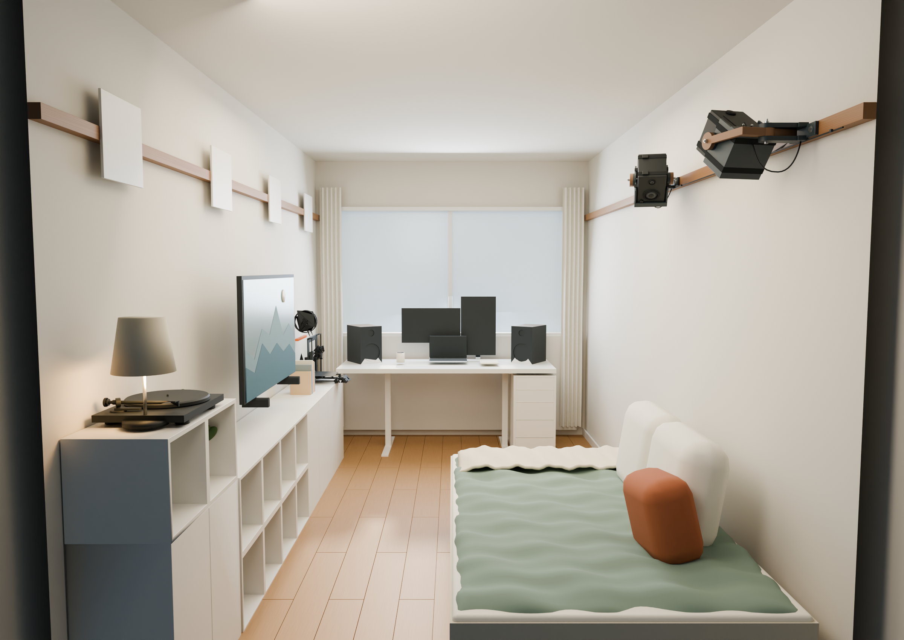
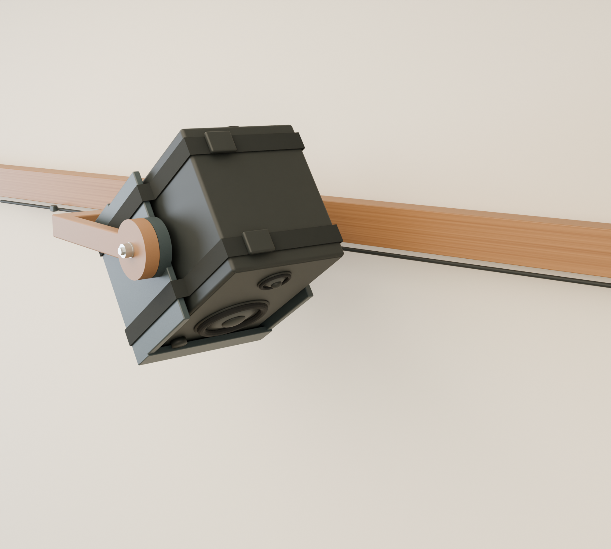

# Eris E3.5 mounts for the dorm-room rail — revision 1.1

Two adjustable mounts at the wooden rail's existing height, anchored **through the wood into concrete**. Every fixing axis stays within the rail's 50 mm-high outline. Sized for the original PreSonus Eris E3.5 / E3.5 BT, **141 W × 162 D × 210 H mm**.

This is a complete CAD prototype with print files and sampled geometric verification. It has **no assigned safe working load** and has not undergone physical print-fit, creep, sustained-load or anchor testing. Establish those before installing above the bed.


Revision 1.1 enlarges the two inner tilt-bolt recesses to Ø32 mm so a nominal 4 mm-thick spanner can counterhold the heads. The pivot bores, teeth, cabinet fit and movement envelope are unchanged; only the cradle STL needs replacing if you already printed revision 1.0. Side foam now has a 36 mm-wide tool window above Z=−18 mm relative to the pitch axis.

New files: [1:1 A4 drilling template](cad/drilling-template-A4-100percent.pdf), [adjustable isolated mount scene](render/mount_inspection.blend), [speaker-removed service view](render/mount-service.png), and [bolt/spanner fit coupon](print/fit-coupons/Tilt_Bolt_Tool_Access.stl).

Print the template at **Actual Size / 100%**, and measure both scale bars. It transfers centres only: choose drill diameter and depth from the actual concrete-fixing instructions. Do not drill a Ø14.2 hole in the concrete just because that is the printed sleeve bore.





## Files

- [Dimensioned drawings and assembly guide](cad/mount-drawings.pdf) — three pages; dimensions, fixing locations, BOM and adjustment.
- [FreeCAD assembly](cad/eris_rail_mount.FCStd) — native solid parts, hardware envelopes and speaker envelope, in the level reference pose.
- [STEP](cad/eris_rail_mount.step) — the three mount solids, in assembly coordinates; import into Fusion.
- [Print files](print/) — one shoe, yoke and cradle per speaker; print **two of each**.
- [Fit coupons](print/fit-coupons/) — new 5-degree tooth profiles, different from revision 3.
- [Editable room scene](render/dorm_room.blend) — actual imported architecture/furniture, both mounts and adjustable aiming controls.

> **Not in the repository.** `render/dorm_room.blend`, `render/room_meshes.json` and the two packaged zips are large binaries, and the room mesh is imported architecture rather than anything in here rebuilds, so they are kept local. Everything needed to print and install the mount — CAD, STEP, STLs, drawings and the drilling template — is committed. Run `rail-mount/package.py` against a local working copy to rebuild the render pack.
- [Room image](render/room.png), [mount detail](render/mount.png), [cutaway](render/overview.png), [both speakers above the bed](render/rail-wall.png).
- [Verification report](cad/validation.json), [solid validation](cad/geometry_validation.json).

## Mount arrangement

The 180 × 46 × 12 mm shoe bears against the timber face. Two fixing centres are **130 mm apart**, on the rail's horizontal centreline. A yaw clevis projects into the room; a U-shaped yoke supports the cradle at both sides near the cabinet's geometric centre. Two short outward-facing tilt bolts stay outside the speaker cabinet. There is no shaft through the speaker and no cabinet drilling.

Movement is **continuous ±90° pan** and **0–60° downward tilt in 5° steps**. These are permitted operating limits, not mechanical stops. Left-side radial teeth provide positive tilt indexing. Right side is smooth. Fully seated to released axial travel is 1.0 mm: the 0.8 mm male teeth then have nominal 0.2 mm tip clearance. Both tilt nuts must be loosened for release. Do not force the teeth to ratchet under load.

The shelf, padded stops and two 20 mm webbing loops retain the speaker. The loops pass under the shelf in the two shallow channels and close on top, leaving the front drivers free. Use 4 mm base padding, 6 mm side padding and 2 mm front/rear stop pads. Final foam compression and actual cabinet fit need checking. The CAD provides a 50 mm-deep rear connector/port allowance, 130 mm wide, from 60 mm below to 96 mm above the pitch axis. Real cable loops, buckle shapes and port airflow need physical checking.

## Starting positions in this room

Coordinates measured **along the rail from the window-end wall**:

| Item | Window-side / right surround | Far-side / left surround |
|---|---:|---:|
| Mount centre | 2646 mm | 4060 mm |
| Fixing holes | 2581, 2711 mm | 3995, 4125 mm |
| Starting pan | +76.10° | −76.10° |
| Starting downward tilt | 55° | 55° |

Both mounts were moved inward from the first layout so the far-side speaker clears the end wall throughout the sampled movement range.

All four fixing axes are **2075 mm above the modeled floor**, at the rail centreline. The plate's top and bottom have 2 mm nominal margin within the rail face. The far-side plate ends at 4150 mm, leaving 250 mm to the modeled rail end. Verify the real rail and concrete edge conditions before using these positions.

Aiming assumes your ears are 350 mm from the wall, at the bed's midpoint (3353 mm from the window end), and 1400 mm above the floor. Your height does not determine exact seated ear position: this remains an estimate. An approximate tweeter point gives about **860 mm speaker separation** after toe-in and approximately 0.78 m from each tweeter to your ears. The 55° indexed settings miss that estimated point by less than 0.7°. Fine-tune the pan and choose an adjacent tilt index after sitting down.

The pivot axis stays at rail height; rotating a cabinet necessarily moves its corners above and below that axis. No drop bracket is used.

## Hardware — quantities per speaker

| Hardware | Quantity | Notes |
|---|---:|---|
| M8 × 80 hex-head bolt | 1 | Yaw; nominal 13 mm across flats, 5.3 mm head height |
| M8 × 45 hex-head bolt | 2 | Separate left/right tilt bolts, inserted from inside outward |
| M8 locking nut | 3 | Nominal 8 mm high; verify supplied hardware |
| M8 washer | 6 | Ø16, 1.6 mm thick; one at each head/nut |
| Metal tube sleeve | 2 | Ø14 outer, ID11, cut to 12 mm; sits in printed Ø14.2 bores |
| Anchor load-spreading washer | 2 | Ø24, ID10.5, 2 mm thick |
| Concrete fixing assembly | 2 | Selected for the actual concrete, edge distances and fixture |
| 20 mm retaining webbing loop | 2 | Approximately 0.8 m stock per loop; trim after fitting; buckle on top |
| Foam padding | As above | Thin closed-cell pads, not thick soft cushioning |

Do not substitute taller socket-head screws at the inner tilt positions without checking the cabinet clearance. Nominal hex-head clearance to the speaker is only 2.6 mm before tolerances. A nominal 30 mm-wide, 4 mm-thick spanner head with a 100 mm handle passed 78 access samples (both sides, all tilt indices, ±15° handle swing), with a 2.9 mm nominal gap to the cabinet. A Ø20 × 40 mm outer socket access envelope also cleared. Check your actual tools with the coupon; larger tools are not covered. Cut back the side padding at the opening before assembly.

The metal sleeves limit compression of the printed shoe under the anchor washers; the timber is still part of the bearing interface.

### Through-rail concrete fixings

The fixture stack is **40 mm wood + 12 mm shoe + 2 mm washer = 54 mm**, plus any actual gap or finish between wood and concrete. Concrete embedment must be added to this; the timber is not embedment. The two bores accommodate an anchor body up to nominal Ø10 inside the metal sleeves. Long shanks in the CAD/render illustrate the fixing axes; they are not models of a selected proprietary anchor.

Choose a concrete-approved fixing for this stack, its required embedment, minimum spacing and actual concrete edge distances. A nominal 140 mm fixing leaves 86 mm beyond a 54 mm stack geometrically, but that arithmetic alone does **not** establish effective embedment or suitability. Do not infer a drill depth, torque or load rating from the CAD. Fischer's [SXRL product documentation](https://www.fischer.co.uk/en-gb/products/frame-fixings/frame-fixing-sxrl/frame-fixing-sxrl-with-countersunk-head-screw) is one manufacturer reference for through-fixings; use the exact selected product's instructions and supplied matching screw.

All installed fixing holes pass through the wood. No fixing above or below the rail is proposed. The narrow plate transfers overturning forces through its timber bearing area and the anchors, so tight, sound timber and suitable concrete fixing design matter even though screws reach concrete.

## Printing and assembly

STLs are in **millimetres**, already oriented on their X side. Keep the supplied orientation unless reassessing layer strength. The principal arm bending plane is then within layers. Supports are required around elevated ears, cross-members and the far side of the cradle. Do not let supports damage the teeth or friction faces.

| Part | Supplied print X × Y × Z |
|---|---:|
| Rail shoe | 61 × 161 × 180 mm |
| Pan yoke | 64 × 243 × 221 mm |
| Cradle | 151 × 180 × 189 mm |

Allow support and brim space. A **250 × 250 × 250 mm or larger** build volume is the practical starting point; the yoke leaves little brim space along its 243 mm dimension. The supplied yoke orientation exceeds a 200 mm build height. The Prusa printer modeled in the room is not proof that these files fit your available printer.

PETG or ASA is a starting material choice, not a strength rating. Start with 6 perimeters, 6 top/bottom layers and 50% infill, with solid regions at bolt bores, teeth and arm roots. Use 0.20 mm layers generally and 0.10–0.12 mm in the tooth-profile regions. Inspect the sliced teeth. Nylon locknuts prevent easy nut loosening; they do not prevent printed plastic creep.

1. Print the two tooth coupons and the new bolt/tool-access coupon. Check tooth seating/release, then fit the actual M8 bolt and 1.6 mm washer and try the spanner before printing the full cradle.
2. Print and inspect all parts. Verify Ø8.5 pivot clearances and sleeve fit; reject split layers, voids or damaged teeth.
3. Insert each tilt bolt and its inner washer from inside the cradle before placing the cradle in the yoke. Fit outer washers and locking nuts. Join yoke and shoe with the yaw bolt.
4. Fit pads with the tool windows relieved, the actual speaker and both retaining straps. Ensure bolt heads, straps and cable plugs clear at the intended angles.
5. Test with a restrained dummy load close to the floor, including prolonged dwell at operating temperature and the worst permitted poses. The individual powered/passive cabinet masses must be measured; the manufacturer's 2.9 kg figure is for the pair.
6. Have the selected concrete anchorage checked for the substrate and load path, then install through the marked rail positions following that product's drilling/cleaning/torque instructions.
7. Provide independent overhead retention that bypasses the printed load-bearing joints, attached using permitted through-rail concrete fixing locations. The two cradle straps retain the cabinet within the cradle but are not a backup for failure of the shoe or yoke.
8. Aim while supporting the speaker. Loosen both tilt nuts, shift the cradle right to release, select a 5° position, seat the teeth left and retighten. Keep pan within ±90°. Recheck after initial settling.

## What was verified

Three valid, single-solid BReps and closed positive-volume exported STLs. **247 combined pan/tilt samples**, pan in 10° increments and tilt in 5° increments, clear the shoe, rail and concrete. All 13 tilt indices clear at nominal and seated positions. Three half-index samples intentionally interfere when seated, and 31 released samples clear. A further 494 poses across the two installed mounts were checked against room end planes, ceiling, floor and opposite wall. Nominal hardware envelopes were also checked against moving components, the cabinet, connector allowance and fixed mounting geometry.

These are sampled rigid-geometry checks, not continuous swept-volume proof. Purchased fastener tolerances, flexible wiring, straps, foam deformation, installation tolerances, print anisotropy, wear and long-term creep are not qualified by these tests.

A uniform cabinet has its centre of mass at the pitch axis, reducing nominal tilt torque. Actual centre of mass is unknown, especially in the powered cabinet. At level and zero pan, the cabinet centre is 360 mm from concrete: **3.53 N·m wall moment per kilogram of speaker mass**, before adding printed parts, hardware or handling loads. At the starting inward pan it is approximately 220 mm from concrete. No strength inference is made from these lever arms.

## Room scene and controls

The architecture, window opening, bed, desk, cabinets, TV, turntable and printer come from `Værelse 65 POP.step`. The two modeled Eris cabinets beside the TV are relocated to the rail. Original desk speakers remain on the desk. Materials, bedding, curtains, small decor and lighting are visualization choices, not claims about your current finishes.

Open `render/dorm_room.blend`. Select **Surround_left / AIM CONTROLS** or **Surround_right / AIM CONTROLS** in the Outliner. In Object Properties → Custom Properties:

- `pan_deg`: −90 to +90, continuous.
- `tilt_step`: 0–12, each step equals 5° downward.

The shoe stays fixed, the yoke pans, and the cradle/speaker tilt together. Cable service loops are illustrative and do not deform automatically with the controls. The rear architecture is hidden from render for the doorway camera; the cutaway additionally hides the near wall and ceiling. The complete imported geometry is retained in the scene.


### Dedicated mount inspection

Open `render/mount_inspection.blend`; the control object is selected. In its Custom Properties, use `pan_deg`, `tilt_step` and `show_speaker`. Switching off `show_speaker` hides the cabinet and straps to expose the cradle, foam tool windows and inner bolt heads. The studio file uses the same CAD meshes as the room scene.

### Channel labels and wiring

Left/right is now explicitly referenced to **you sitting in bed facing the TV**. The window-side position (2646 mm) is the right surround; the far-side position (4060 mm) is the left. Early revision-1.0 labels were swapped; the physical positions and aiming angles are unchanged.

The render places the powered Eris on the window side. With that choice, send the source's **surround-right line output to the Eris L input** (which feeds the powered cabinet), and its **surround-left line output to the Eris R input** (which feeds the passive companion). Run speaker wire between the pair. Confirm with the source's left/right channel test before use. The labels on the Eris inputs describe its internal routing, not a requirement to put the powered cabinet on the left. See the [PreSonus manual](https://pae-web.presonusmusic.com/downloads/products/pdf/ErisE3.5_OwnersManual_EN_V2_23072018.pdf). The source/receiver remains unspecified; this is channel mapping, not a confirmed connection plan for a particular receiver.

## Reproduction

```bash
env QT_QPA_PLATFORM=offscreen python rail-mount/design.py
env QT_QPA_PLATFORM=offscreen python rail-mount/validate.py
env QT_QPA_PLATFORM=offscreen python rail-mount/installation.py
env QT_QPA_PLATFORM=offscreen python rail-mount/make_documents.py
env QT_QPA_PLATFORM=offscreen python rail-mount/fabrication.py
blender --background --factory-startup --python rail-mount/render_room.py
blender --background --factory-startup --python rail-mount/studio_view.py
```

`design.py` contains all dimensions and the new tooth geometry. `render/room_meshes.json` holds the converted STEP geometry; the printer's fine mesh is simplified for rendering. Existing revision 3 files remain separate.

Speaker dimensions and pair architecture: [PreSonus Eris E3.5 / E3.5 BT owner's manual](https://pae-web.presonusmusic.com/downloads/products/pdf/Eris-series_E3.5_E3.5_BT_E4.5_E4.5_BT_OwnersManual_EN_11102019.pdf).
